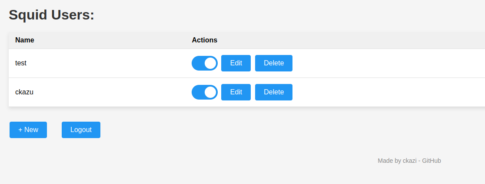

The easiest way to run squid proxy server with UI(Add/Edit/Disable/Enable/Delete users)

After getting acquainted with the project https://github.com/wg-easy/wg-easy, I realized that it's not always convenient for some projects to have all the traffic go through WireGuard. Sometimes, you only need one browser (like Firefox) set up through a proxy, while the entire system is configured without using a proxy. This is how the idea was born to run Squid in a container with username and password authentication. However, as it turned out, there is no working tool for user management. Thus, this project was born.

# Squid Easy

You have found the easiest way to install & manage Squid proxy server on any Linux host!

<p align="center">
  
</p>

## Features

* All-in-one: Squid Proxy Server + Web UI.
* Easy installation, simple to use.
* List, create, edit, delete, enable & disable clients.

## Requirements

* A host with Linux/Windows
* A host with Docker installed.

## Installation

### 1. Install Docker

If you haven't installed Docker/docker-compose yet, install it by running:

```bash
$ apt-get update && apt-get upgrade -y && apt-get install docker.io docker-compose -y
```

### 2. Run Squid Easy

To automatically install & run wg-easy and squid-easy simply run:

<pre>
$ git clone https://github.com/ckazi/squid-easy
$ cd squid-easy
> 💡 Replace `WG_HOST` in docker-compose.yml file with a IP  of your server.
> 💡 Replace `PASSWORD` in docker-compose.yml file with a password to log in on the Web UI for WireGuard.
> 💡 Replace `SQUID_ADMIN_PASSWORD` in docker-compose.yml file with a password to log in on the Web UI for Squid.
$ docker-compose up -d
</pre>

In this docker-compose file, 3 services are described (wg-easy, squid-easy, and squid), and after launching, you will have access to both WireGuard with UI and Squid with UI.
IMPORTANT! Before launching, edit the docker-compose.yml to your preferences (IP, UI password).

The Squid Web UI will now be available on `http://0.0.0.0:51823`.
The WireGuard Web UI will now be available on `http://0.0.0.0:51821`.

### 3. Sponsor

Are you enjoying this project? [Buy me a beer!](bitcoin 14rZYabpHSsKKgYvsVcEgmuyR3x9XfR4WA ) 🍻